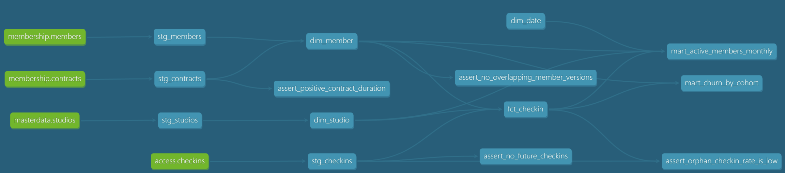

# Dummy ELT pipeline built with dbt
[](https://github.com/whythename/member-analytics-dbt/actions/workflows/dbt-ci.yml)


This is a complete ELT pipeline built for the member data of a gym chain:

Synthetic source data -> dimensional model -> two fictional business dacing marts

Includes basic tests, documentation and a CI pipeline.
The point is to create a working, maintainable data model, no focus on moving large volumne of data.

## Usage
Clone repo, then: 
```bash
pip install -r requirements.txt

python scripts/generate_data.py     # dummy data creation
python scripts/load_raw.py          # raw data loaded to DuckDB

export DBT_PROFILES_DIR=.
dbt build                           # execute models and tests
dbt docs generate && dbt docs serve # view lineage graph in browser
```
No accounts or creds needed, runs locally in <2 min

## Architecture
```
scripts/generate_data.py     synthetic source data (CSV)
          |
scripts/load_raw.py          load without transformation (replace with ir Fivetran in PROD)
          v
  raw_membership / raw_access / raw_masterdata        (DuckDB, use ie Snowflake in PROD)
          |
  staging   views      rename, cast, clean             (dbt, use ie dbt cloud in PROD)
  core      tables     star schema, SCD type 2
  marts     tables     business metrics
          v
  Reporting / ML features
```
For demo purposes managed connector services are replaced by a Python loader with dummy data, a cloud warehouse is replaced by DuckDB (no cred necessary, no trial account)

## Lineage

Generated with `dbt docs generate`

## Fictional business questions
1. How many active members and how much recurring revenue per month, brand and plan?
2. What share of signup cohort cancels after 3, 6 and 12 months?
3. Does visit frequency drop before cancellation? From what point on?

1 and 2 get answered by the created marts. 3 is answerable with `fct_checkin` and `dim_member` as feature base for a churn model, that is deliberately out of scope.

**Definitions:**
- *Active* = a contract was still running at end of month.
- *Churned* = the most recent contract has an end date. Gaps between two contracts do not count as churn.
- *Cohort* = month of first signup

## Modelling decisions

**`dim_member` as slowly changing dimension, type 2:** members could switch plans and/or rejoin after a break. With type 1 dimension, every checking would be incorrectly attributed to the current plan.

**Range join in `fct_checkin`:** Including the validity window in the join makes sure that a single checkin only shows once, avoiding a fan-out.

**Two raw schemas instead of one:** `raw_membership` and `raw_access` represent separate (fictional) source systems to represent a real world problem

**Cohort maturity as a column:** `mart_churn_by_cohort` carries `is_mature_3m/6m/12m`. Cohorts with timeframes lower than the months of the churn rate result in zero precent, because there was no time to churn. This visualizes this precondition.

## Data quality

The generator deliberately introduces source system problems:

| Problem | Handled by |
|---|---|
|Double scans (identical rows)|deduplication in `stg_checkins`|
|Missing birth dates |set to NULL in `stg_members`| 
|Inconsistent spelling in aquisition channels|normalized in `stg_members`|
|Empty string instead of NULL for open contracts|`nullif` in `stg_contracts`|
|Check-ins with an unknown member_id|inner join in `fact_checkin`|

Alongside with generic tests (unique, not_null, relationships, accepted values), there are some business assertins in the `tests/` dir.

## CI

`.github/workflows/dbt-ci.yml` runs on every pull request. It installs dependencies, generates the data , loads it, executes dbt build (errors would show there as quality gate) and builds the docs that get uploaded as artifact.

`dbt build` executes models and tests in dependency order. If a test fails, downstream models do not run.

`dev` and `ci` write to separate schemas (`profiles.yml`) so a CI run can never overwrite tables someone is currently working with.

